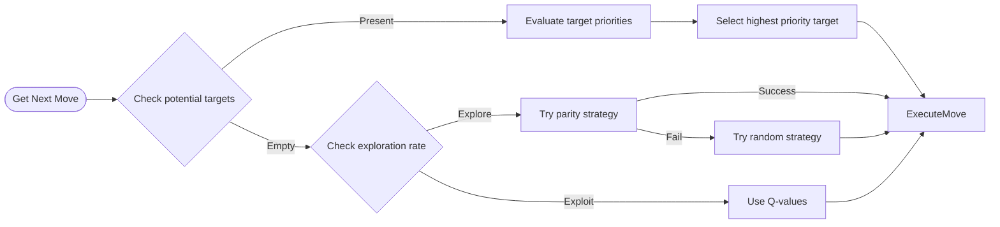
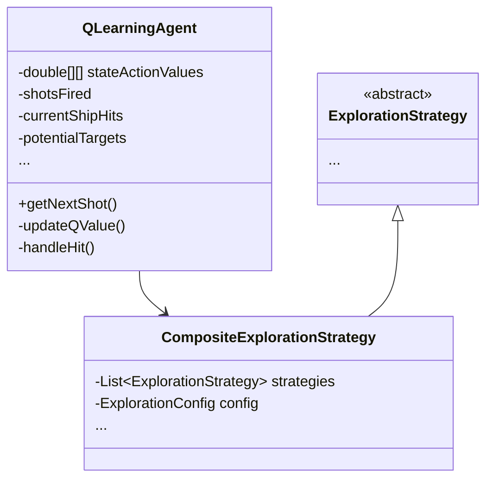

# RL-Battleships

A Java implementation of the classic Battleship game featuring networked multiplayer, bot play, and AI capabilities. The game runs in the command line and supports multiple play modes while maintaining core Battleship gameplay mechanics.

## Overview

The game follows standard Battleship rules where players attempt to sink their opponent's fleet on a 10x10 grid. Ships are placed on the generated boards with proper spacing and orientation rules. Players take turns calling shots using coordinate notation (e.g., "A5"), receiving feedback on hits and misses.

## Game Modes

### Network Multiplayer
Enables two players to compete over a network connection using a client-server architecture.

Server:
```bash
java Main -mode server -port 5000
```

Client:
```bash
java Main -mode client -port 5000 -host localhost
```

### Bot Mode
Provides practice gameplay against a computer opponent using basic targeting strategies.
```bash
java Main -mode bot
```

### AI Mode
Offers gameplay against an intelligent opponent that employs reinforcement learning for target selection.
```bash
java Main -mode ai
```

# AI Implementation

The AI implementation leverages [Q-learning](https://en.wikipedia.org/wiki/Q-learning), a model-free reinforcement learning algorithm and combines it with  pattern recognition, allowing adaptation of the strategy during gameplay.

It is built around a state-action value matrix that updates based on outcomes. 
Its exploration strategy ensures efficient board coverage and prevents falling into local optima. 
The system is based on three components:

1. [**The Q-Learning Core**](src/ai/QLearningAgent.java#L123) processes game state and updates action values based on feedback.
   It maintains the game state through [sophisticated hit tracking](src/ai/QLearningAgent.java#L78) and
   [ship orientation detection](src/ai/QLearningAgent.java#L156). 

5. [**The Exploration Strategy**](src/ai/CompositeExplorationStrategy.java) manages the balance between exploring new strategies and exploiting learned patterns.
   It employs multiple complementary strategies through its [composite architecture](src/ai/CompositeExplorationStrategy.java#L15),
   from [systematic search patterns](src/ai/ParityExplorationStrategy.java) to probability-based targeting.

7. [**The Decision Engine**](src/ai/QLearningAgent.java#L45) combines learned values with current game state, and considers factors such
   as ship size constraints, board geometry, and discovered patterns to make optimal decisions.

## Decision Flow

The following diagram illustrates the decision-making process:



The AI doesn't randomly search for ships, but builds a probabilistic model of likely ship locations based on discovered ship segments and their orientations. This approach mirrors how human players analyze the game board, making the agent challenging and believable as an opponent.

## Architecture

Below is the simplified class structure showing how the agent components interact:



For a deeper understanding of the implementation:
- See the [Q-Learning update mechanism](src/ai/QLearningAgent.java#L90-L110)
- Review the [exploration rate adjustment](src/ai/CompositeExplorationStrategy.java#L45-L55)
- Check out the [ship pattern recognition](src/ai/QLearningAgent.java#L156-L170)
